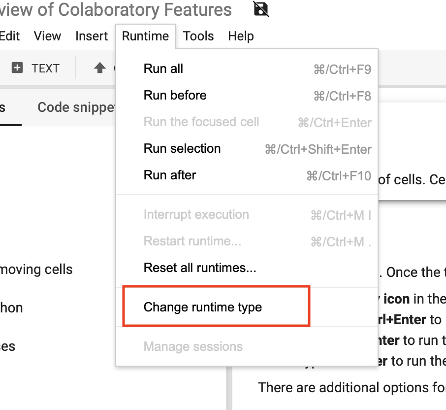
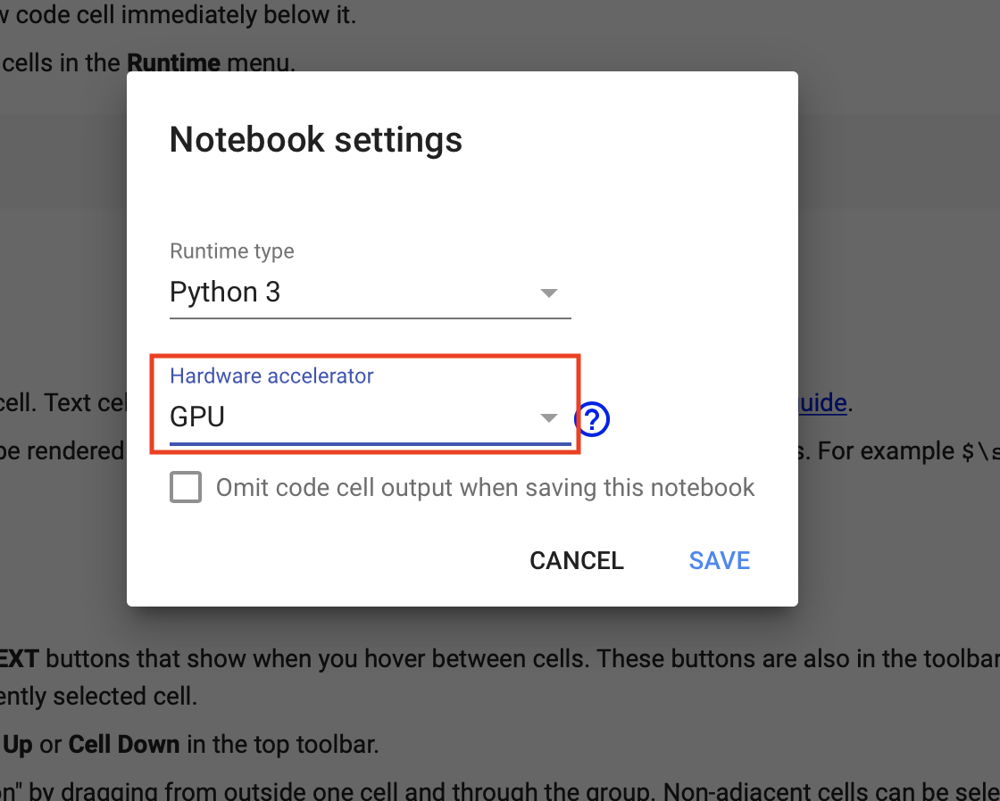
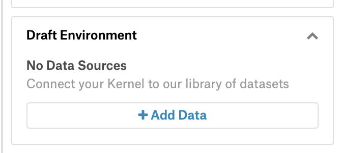
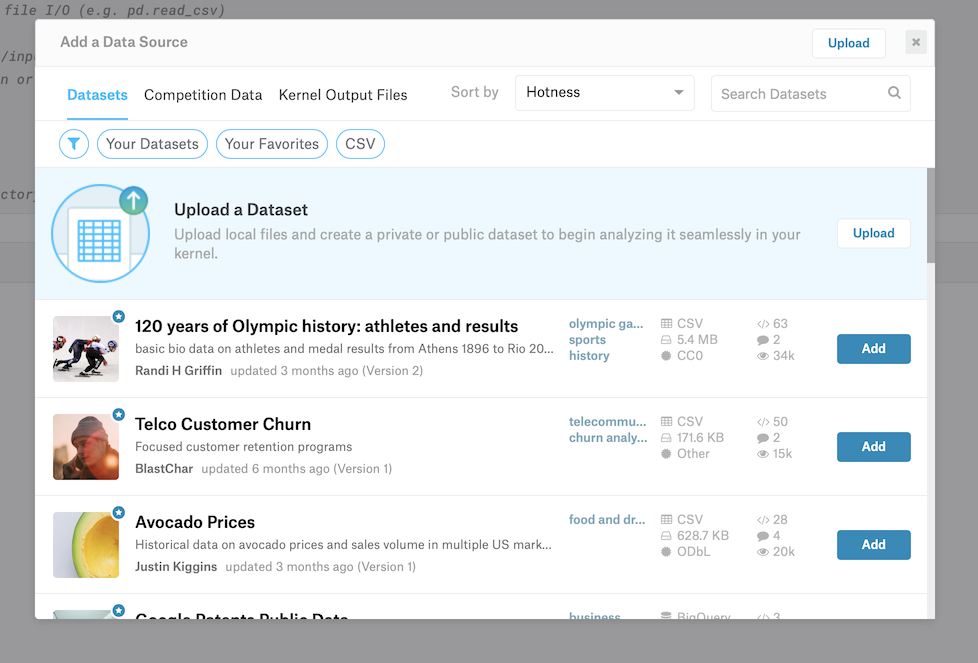
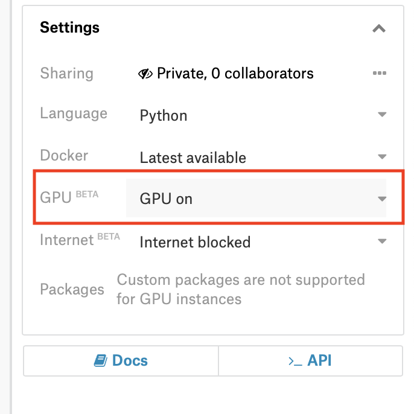

# Machine Learning execution environments

The environment we use for machine learning is [jupyter notebooks](http://jupyter.org). These can be run on your local machine, a remote machine plus rendered and viewed on the web. Below we'll list out a few options to get started with these notebooks.

### Contents
1. [Google Colaboratory](#google-colab)
1. [Kaggle Kernels](#kaggle-kernels)

## Google Colab
Colaboratory is hosted by Google and can easily store your notebooks into your Google Drive. To get started, head to https://colab.research.google.com. 

A great place to start is going through the [Basic Features notebook](https://colab.research.google.com/notebooks/basic_features_overview.ipynb)

### GPUs on Google Colab
Graphics Processing Units (GPUs) are mentioned a lot in machine learning and they will become required on larger models and datasets to be able to complete training in an appropriate amount of time. Google colab provides a GPU for free:

1. From the menu choose 'Runtime' -> 'Change runtime type'

1. From the modal change the 'Hardware accelerator' to 'GPU'

Now when you run your code, you will be using one of Google's GPUs for free. The main limitations here will come in terms of total time you can run for and they can be reallocated without warning. If this happens, you'll reconnect and run again.

## Kaggle Kernels
[Kaggle](https://kaggle.com) is a community of data scientists and machine learners that got started by offering competitions and public data. 

[Kaggle Kernels](https://www.kaggle.com/kernels) are there execution environment and can do very similar things to Google's Colab. Head to the kernels page and click 'New Kernel' and choose 'Notebook' in the modal to create your first Notebook there. 

The other benefit of Kaggle kernels is there GUI interface for adding data and other resources to your notebook environment. This can be extremely useful for getting data for a Kaggle competition into your notebook.

1. From the sidebar choose '+ Add data'

1. The modal will allow you to choose a data source to add to your notebook

Again, Kaggle kernels can be run with a GPU: In the sidebar, there is a dropdown for GPU. Choose 'GPU on' to enable a GPU for your notebook
